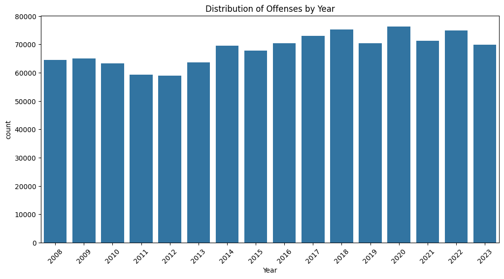

# Exploratory Data Analysis

## Data Cleaning Process
1. Drop N/A rows with missing in 'Offense Start DateTime', 'Offense Parent Group', 'Longitude', 'Latitude'.
2. Use Offense Start DateTime for EDA and change it to datetime
3. Filter data with Offense Start Year from 2008 to 2023

### Distribution by Year

### Distribution by MCPP

### Distribution by Sector

### Distribution by Offenses

### Distribution by Offenses Group

### Distribution by Crime Against Category

### Distribution by Day

### Distribution by Month

